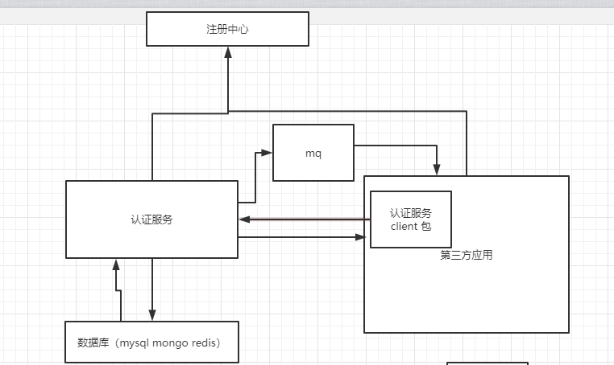

## 认证组件说明

认证组件是一个可独立运行的组件，并支持集群部署，通过sdk包对外提供权限管理和认证登录的等功能，通过外部配置文件指定相关配置项就可以运行并管理注册登录权限范围。

## 架构图

## 概述

认证组件分为server 端 和 client 端，

server端通过外部配置文件指定注册中心，数据存储方式及地址数据同步方式及地址。

server端提供访问界面，在页面上配置第三方应用数据同步方式，当认证服务更新用户信息时同步到第三方应用，并记录同步结果（可先实现mq同步，其他同步方式后期跌代）。

server 端提供查询用户权限的界面，用于修改和查看用户相关信息。

server 端提供查询第三方应用界面，用于查询和配置第三方应用，以接入认证中心

client端为封装好的jar包或maven依赖，提供相关功能调用方法，包括用户信息查询与更新，权限查询与更新。

认证中心应支持单体项目的接入（作为二期跌代）和分布式项目的接入，分布式项目接入的情况可先暂时只实现支持nacos注册中心。

## 详细设计

### 库表设计

### 功能流程图